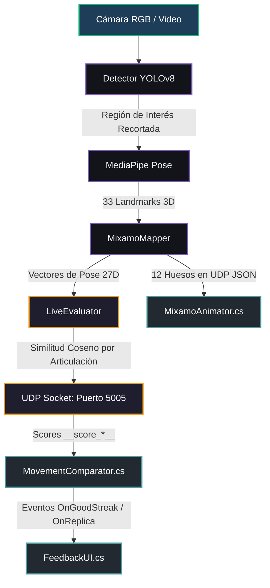

# Manual de Documentación Técnica y de Usuario — Dance Labo (LABITO)
## Sistema Inteligente de Captura, Análisis y Evaluación de Movimientos de Baile

Este documento constituye la guía definitiva técnica y de operación para el ecosistema **Dance Labo**, detallando la justificación de las herramientas seleccionadas, la arquitectura de comunicación por red, la metodología de Machine Learning, el manual de usuario paso a paso y la resolución de problemas comunes.

---

## 1. Introducción y Propósito del Sistema

El proyecto **Dance Labo** (conocido en código como **LABITO**) nace con la finalidad de automatizar y democratizar la enseñanza artística y los procesos de rehabilitación física mediante el uso de inteligencia artificial. Tradicionalmente, la captura de movimiento óptico requería laboratorios costosos y trajes con marcadores reflexivos. Dance Labo propone una solución interactiva de captura monocular libre de marcadores (*markerless capture*) utilizando una cámara web convencional.

El sistema realiza tres funciones principales de forma integrada:
1. **Captura y Retransmisión (Capture Studio):** Extrae los movimientos de una persona frente a la cámara RGB en tiempo real y los replica tridimensionalmente sobre un avatar esquelético en el motor gráfico Unity.
2. **Modelado Secuencial (Machine Learning):** Entrena modelos de redes neuronales profundas que aprenden la dinámica espaciotemporal de una danza.
3. **Evaluación de Desempeño (Live Evaluation):** Compara el baile del usuario frente a la referencia ideal frame a frame, calculando desviaciones geométricas y enviando un feedback interactivo por colores en Unity.

---

## 2. Justificación Técnica del Ecosistema (Tech Stack)

Para garantizar un rendimiento estable y preciso a tiempo real (30 FPS) en computadoras comerciales comunes (sin necesidad de GPU dedicada), se diseñó un pipeline de visión híbrido y ligero:

| Herramienta | Función Principal | Razón de Elección y Ventajas |
|---|---|---|
| **YOLOv8 (Ultralytics)** | Detección de Personas y Región de Interés (RoI) | Evita falsos positivos y ruido de fondo. Al recortar la silueta del usuario y aislarla antes del análisis esquelético, incrementa de forma masiva la inmunidad al ruido visual ambiental. |
| **MediaPipe Pose (Google)** | Estimación de Landmarks esqueléticos en 3D | Genera los 33 landmarks corporales con coordenadas espaciales (x, y, z) de forma extremadamente ágil sobre CPU. Su integración posterior al recorte de YOLO optimiza su estabilidad. |
| **MixamoMapper (Python)** | Traducción de Landmarks a Rig de Huesos | Traduce las coordenadas de MediaPipe a un vector normalizado de 12 articulaciones (vectores unitarios 3D). Esto aísla la fisionomía del usuario, impidiendo que su altura o peso sesguen la evaluación del movimiento. |
| **PyTorch (LSTM)** | Modelado Secuencial | A diferencia de clasificadores simples que aplanan las secuencias perdiendo el hilo del tiempo, la celda Long Short-Term Memory (LSTM) retiene la dinámica temporal y las transiciones secuenciales del baile de forma nativa. |
| **PyQt6 (Python UI)** | Interfaz Gráfica de Usuario | Ofrece una plataforma moderna, fluida y con diseño oscuro premium para controlar la cámara, grabaciones, entrenamiento y evaluación sin dependencias web lentas. |
| **Unity 3D** | Motor Gráfico de Renderizado | Proporciona un entorno interactivo óptimo para reproducir las danzas sobre rigs de Mixamo y albergar la UI de retroalimentación en tiempo real para el estudiante. |

---

## 3. Arquitectura del Sistema y Puente de Red (UDP Bridge)

Dado que el procesamiento pesado de Machine Learning y visión artificial corre en **Python** y el renderizado interactivo ocurre en **Unity**, el sistema implementa un puente de red bidireccional asíncrono e instantáneo basado en el protocolo **UDP (User Datagram Protocol)** a través del **Puerto 5005**:



### Canales UDP de Comunicación:
1. **Pose Stream (Envío a Unity):** Python transmite de forma continua un string JSON que contiene las orientaciones de los 12 huesos de Mixamo (ej: `mixamorig:LeftArm`, `mixamorig:RightArm`). El componente `MixamoAnimator.cs` de Unity parsea este paquete a 30 FPS y rota los huesos del avatar 3D para replicar la pose exacta en pantalla.
2. **Scoring Stream (Envío a Unity):** Cuando el modo de **Evaluación en Vivo** está encendido, el hilo matemático de Python calcula las similitudes coseno de los 5 segmentos críticos (brazo izquierdo, brazo derecho, pierna izquierda, pierna derecha y torso). Transmite estas calificaciones a través de llaves reservadas especiales (`__score_overall__`, `__score_torso__`, etc.), las cuales son ignoradas por el animador de poses y capturadas de manera directa por `MovementComparator.cs` en Unity para alimentar los indicadores en pantalla del canvas.

---

## 4. Manual de Instalación y Configuración del Entorno (Python)

Sigue estos pasos en tu computadora Windows para configurar el entorno de ejecución de Python:

### Paso 1: Clonar y Acceder al Directorio
Abre una terminal de **PowerShell** en Windows y navega al directorio del proyecto de Python:
```bash
cd c:\Users\danie\Desktop\tareas\uabc\labtech\LABITO\motion_ml_app
```

### Paso 2: Crear el Entorno Virtual (venv)
Es necesario aislar las dependencias del proyecto de tu sistema global de Python:
```bash
python -m venv venv
```

### Paso 3: Activar el Entorno Virtual
Activa el entorno virtual en la terminal actual de PowerShell:
```bash
.\venv\Scripts\activate
```
*(Verás el prefijo `(venv)` al inicio de tu línea de comando).*

### Paso 4: Instalar Dependencias
Instala todas las bibliotecas requeridas listadas en `requirements.txt`:
```bash
pip install -r requirements.txt
```

### Paso 5: Validar el Entorno
Ejecuta el script de verificación automatizado para confirmar que todas las dependencias y archivos de modelos se encuentran instalados de forma idónea:
```bash
python check_env.py
```

---

## 5. Manual de Operación de la Interfaz (PyQt6)

Para iniciar la consola de captura y control, asegúrate de tener el entorno virtual activo y ejecuta:
```bash
python main.py
```

Se abrirá una interfaz gráfica oscura y premium diseñada con iconos vectoriales de alta resolución. A continuación, se detalla la operación de cada panel:

### A. Panel de Carga y Visualización (Lado Izquierdo)
* **Cargar Video:** Permite importar un archivo de video local (`.mp4`, `.avi`, `.mov`) para analizarlo o preprocesarlo.
* **Usar Cámara (Toggle Inteligente):** Al hacer clic, enciende el flujo de tu cámara web por defecto. El botón cambia dinámicamente a **Detener Cámara** y su icono se actualiza a un botón de detención. Vuelve a hacer clic para apagar el sensor de video de forma segura y liberar la cámara web.
* **Selector de Cámara (Desplegable):** Si posees múltiples cámaras conectadas (ej: integrada y USB), selecciona el índice del dispositivo correspondiente aquí. Pulsa el botón de actualizar lateral para volver a escanear los puertos de red.

### B. Grabación de Secuencias de Referencia
1. Escribe el nombre del movimiento coreográfico en el cuadro de texto **Nombre del baile** (ej: `Secuencia1`).
2. Haz clic en el botón unificado **REC**. El botón se transformará a **STOP** en color naranja, se habilitará el botón **CANCELAR** al lado derecho y se encenderá un indicador parpadeante `● REC` rojo al lado del título superior.
3. Si la grabación sale mal, presiona **CANCELAR** para vaciar el búfer de memoria y descartar los frames. Al finalizar con éxito, pulsa **STOP** para guardar la secuencia en `data/sequences/`.
4. **Bote de Basura (Eliminación Segura):** Al lado del selector de secuencias, un botón con el icono de un bote de basura rojo y blanco permite eliminar grabaciones. Para prevenir eliminaciones por error, al pulsarlo se abrirá un cuadro de confirmación (Sí/No) y posteriormente requerirá escribir exactamente el nombre de la secuencia como clave de doble seguridad.

### C. Inteligencia Artificial, Evaluación y Logs
* **Entrenar Modelo (Capa LSTM y Árbol de Decisión):** Ejecuta en segundo plano el entrenamiento del modelo. Genera el archivo `data/motion_model.pt` y actualiza el mapeo de clases.
* **Reproducir (LSTM):** Transmite a Unity la pose simulada por el modelo LSTM.
* **Secuencia Exacta:** Envía la pose grabada frame a frame (sin procesamiento de IA).
* **Evaluar en Vivo:** Compara tu pose en tiempo real contra la referencia LSTM.
* **Historial de Logs (Botón de Libreta):** Ubicado en el panel de **Estado** superior. Permite abrir un visor modal flotante que despliega el historial completo de eventos del sistema (inicialización, red UDP, carga de modelos y epochs de entrenamiento) coloreado en tiempo real sin saturación de conteo de frames. El sistema cuenta con redirección nativa de consola (`sys.stdout`) conectada a señales Qt para asegurar que el registro desde subprocesos paralelos sea 100% estable (*thread-safe*).

---

## 6. Guía de Integración e Instalación en Unity 3D

Para recibir la señal y visualizar el avatar tridimensional junto con los paneles de feedback dinámicos, debes configurar los siguientes scripts C# en tu escena de Unity:

### Paso 1: Configurar el Receptor UDP y Animador
1. En tu jerarquía de escena de Unity, selecciona el GameObject que contiene al avatar 3D (el personaje con rig de Mixamo).
2. Asegúrate de tener el script `UDPClient.cs` agregado a este GameObject. Configura el puerto de escucha en **5005**.
3. Agrega el script `MixamoAnimator.cs` al mismo GameObject. Este script leerá automáticamente los datos de la articulación recibidos por `UDPClient.cs` y los aplicará al esqueleto del personaje en tiempo real.

### Paso 2: Configurar la Comparación de Movimientos
1. En el mismo GameObject de tu personaje, agrega el componente `MovementComparator.cs`.
2. Este script se encargará de interceptar y parsear las llaves especiales de puntuación de red (`__score_*`).
3. Define los límites de color en el Inspector si deseas ajustar la sensibilidad (ej: verde para precisiones mayores al 75%, amarillo entre 50% y 74%, y rojo para precisión inferior al 50%).

### Paso 3: Configurar el Canvas de Retroalimentación (Feedback UI)
1. Crea un Canvas de interfaz de usuario en tu escena (`GameObject -> UI -> Canvas`).
2. Agrega el script `FeedbackUI.cs` a un objeto vacío dentro de este Canvas.
3. En el Inspector, asigna las referencias visuales de tu Canvas al script:
   * **Comparator:** Arrastra el GameObject del personaje que contiene el script `MovementComparator.cs`.
   * **Score Global (TextMeshPro):** Elemento de texto que mostrará el porcentaje global en tiempo real (ej: `87%`).
   * **Paneles de Segmento (Image):** Arrastra las imágenes del Canvas correspondientes a la silueta del brazo izquierdo, brazo derecho, pierna izquierda, pierna derecha y torso. El script interpolará dinámicamente los colores de estas imágenes entre verde, amarillo y rojo basándose en la precisión.
4. Entra en **Play Mode** en Unity para comenzar a recibir la señal interactiva de Python.

---

## 7. Resolución de Problemas Comunes (Troubleshooting)

### A. OpenCV no puede abrir la cámara (Warning cap.cpp)
* **Síntoma:** Al arrancar el programa, aparecen múltiples advertencias en consola referentes a `VideoCapture VIDEOIO(DSHOW)`.
* **Causa:** OpenCV está escaneando los controladores del sistema para identificar cámaras USB. Es un comportamiento informativo de Windows y es completamente inofensivo.
* **Solución:** Si tu cámara no emite imagen al pulsar **Usar Cámara**, asegúrate de que ninguna otra aplicación (como Zoom, Teams o Discord) esté utilizando la cámara web al mismo tiempo. Cambia el índice de la cámara en el desplegable de PyQt6 y vuelve a presionar el botón de actualizar.

### B. El avatar 3D en Unity no se mueve (UDP desconectado)
* **Síntoma:** Python muestra el flujo de la cámara correctamente y detecta tus articulaciones, pero el personaje en Unity se queda inmóvil.
* **Causa:** Hay un bloqueo de socket de red, o los puertos no coinciden.
* **Solución:**
  1. Verifica que tu cortafuegos (Windows Firewall) permita conexiones entrantes locales en el puerto `5005`.
  2. Asegúrate de tener Unity en **Play Mode**. La retransmisión no se reflejará si la escena está en pausa o detenida.
  3. Comprueba en la consola de Unity si hay algún error de parseo de red o si el puerto configurado en `UDPClient.cs` es exactamente `5005`.

### C. La evaluación en vivo marca puntuaciones muy bajas (Descalibración)
* **Síntoma:** Realizas el movimiento correctamente ante la cámara, pero la silueta corporal en Unity se colorea constantemente en rojo.
* **Causa:** Estás colocado demasiado cerca o demasiado lejos del encuadre de la cámara, o la iluminación ambiental impide que MediaPipe distinga tus extremidades con claridad.
* **Solución:**
  1. Mantén una distancia de entre 2 y 3 metros del lente de la cámara, garantizando que tus pies y brazos sean visibles en el cuadro en todo momento.
  2. Evita vestir ropa excesivamente holgada o de colores idénticos al fondo de tu habitación.
  3. Asegúrate de que no haya oclusiones físicas (como sillas, escritorios o cables) obstruyendo la trayectoria visual de tus piernas y torso hacia la webcam.
